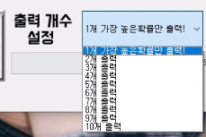

# deeplearning_lotto_with_UI_pyQT5
딥러닝 로또 번호 추첨기 with UI입니다. RNN딥러닝 알고리즘 사용

GUI구현은 pyQT5를 이용했습니다.
pyqt와 tkinter의 차이점을 체험해 보기위해 tkinter도 제작
tkinter를 이용한 GUI는 -> https://github.com/pgs2285/deepleaning_lotto_with_GUI_tkinter

**출력개수 1~10개 설정가능**

**번호 1개 출력(확률가장 높은것들)**

**번호 5개 출력**

